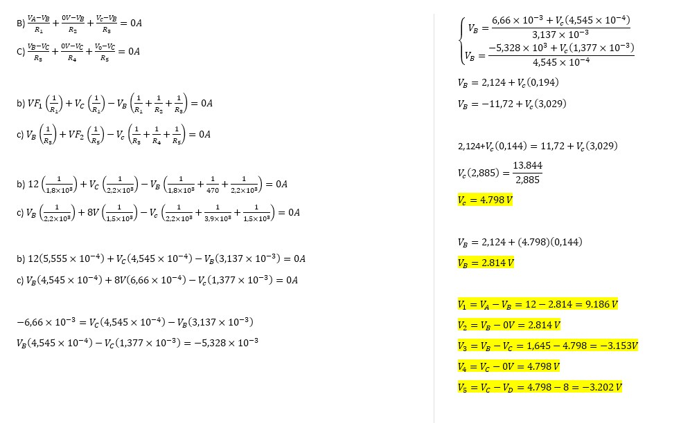

InformeLaboratorioNo3
==========================
# PRÁCTICA No. 3 ANÁLISIS DE NODOS
1. OBJETIVOS
* 1.1 OBJETIVO GENERAL

Resolver y diseñar circuitos eléctricos básicos empleando sus leyes y principios fundamentales, generando una actitud reflexiva, analítica, creativa y ordenada 
Para repasar todos estos conceptos se recomienda usar la información del CAP1 V4.0 de laboratorio de circuitos eléctricos. Analizar el papel que los simuladores de circuitos electrónicos juegan en el proceso de enseñanza-aprendizaje en las materias de Fundamentos de Circuitos Eléctricos de la Rama de Electricidad y Electrónica

* 1.2 OBJETIVOS ESPECIFICOS
  * Controlar el uso de diferentes componentes de simulación de circuitos eléctricos como: Protoboard, Multímetro, Resistencias, Suministro de energía  
  * Conocer los siguientes conceptos básicos de electricidad: corriente eléctrica, magnitudes fundamentales: leyes de Kirchhoff y circuitos eléctricos.
  * Poner en práctica los conocimiento de circuitos eléctricos 
  * Practica de las leyes de voltajes 

2. REQUISITOS PREVIOS
  * Tener conceptos  básicos para el uso  de instrumentación 
  * Saber definición de varios componentes eléctricos 
  * Manejo básico del simulador de circuitos tinkercad
  * Saber ley de Ohm y leyes de Kirchhoff para resolver el circuito 
  
3. INFORMACION GENERAL 

Los simuladores de circuitos electrónicos son muy útiles para explicar el comportamiento de éstos de una forma asequible a los alumnos de la rama de Eléctrica y Electrónica.
El uso de la simulación por ordenador es una herramienta imprescindible hoy en día a la hora de explicar la electrónica en el aula, al ser la forma más sencilla y rápida de comprobar el funcionamiento de un circuito. Además, no necesita ningún tipo de material adicional para el montaje del mismo o medida de los resultados. A lo largo de este trabajo de laboratorio se medirá y calculara valores tanto de voltaje, intensidad y resistencia por medio de los instrumentos del mismo simulador y aplicando las leyes de Kirchhoff

4. MATERIAL Y EQUIPO REQUERIDO

| Cantidad | Material o Equipo | 
| --------- | --------- | 
| 1 | Fuente de Voltaje de C.D. | 
| 1 | Multímetros Digitales | 
| 1 | Resistor de 1.8 KΩ |
| 1 | Resistor de 470 Ω | 
| 1 | Resistor de 1.5 kΩ | 
| 1 | Resistor de 3.9 kΩ |
| 1 | Resistor de 2.2 kΩ |
| 1 | Protoboard | 

5. PROCEDIMIENTO

### 5.1 Arme el circuito que se presenta en la figura 3.1.

 
 
Figura 3.1. Circuito para el análisis de nodos.
 
### 5.2 Mida cada uno de los voltajes de nodo y anote los resultados en la tabla 3.1.

 
### 5.3 Simule en el software Multisim, Proteus, o cualquier otro simulador, el circuito de la figura 3.1, obtenido los valores de los voltajes de nodo. Anote los resultados en la tabla 3.1.
 

### 5.4 Compare los valores de la tabla 3.1 y realice sus conclusiones.

Obtenemos que tanto los valores realizados mediante los calculos de los valores y  de los voltajes en los nodos se asemejan a los obtenidos con el sotfware Multisim, con una leve diferencia en sus decimales, eso nos da a entender que cada valor se encuentra correctamente y se implemento de manera adecuada las LCK.

6. VIDEO

7. CONCLUSIONES

 - Se pudo comprobar que los valores obtenidos de los voltajes de cada nodo  mediante el uso de las leyes Kirchhoff fueron muy semejantes a los obtenidos mediante verificar el circuito analiticamente, con unos pequeños margenes de error.
Asi mismo tanto para las tablas obtenidas, se comprobó el uso de la ley de Kirchhoff, mediante las ecuaciones encontradas, los cálculos obtenidos nos asemejan a una silmulación real, todo este proceso de usar las leyes antes mencionadas nos permiten a que los valores sean precisos y casi exactos, apoyandonos del mismo ciruito para usar las fórmulas como la dirección de los voltajes y las ubicaciones de las resistencias, sus trayectorias y el análisis imperial sobre como usarlas correctamente.

8. BIBLIOGRAFIA

Youtube.com. 2021. Before you continue to YouTube. [online] Available at: <https://www.youtube.com/watch?v=_Xd9LYtJbfw&feature=youtu.be> [Accessed 15 June 2021].
